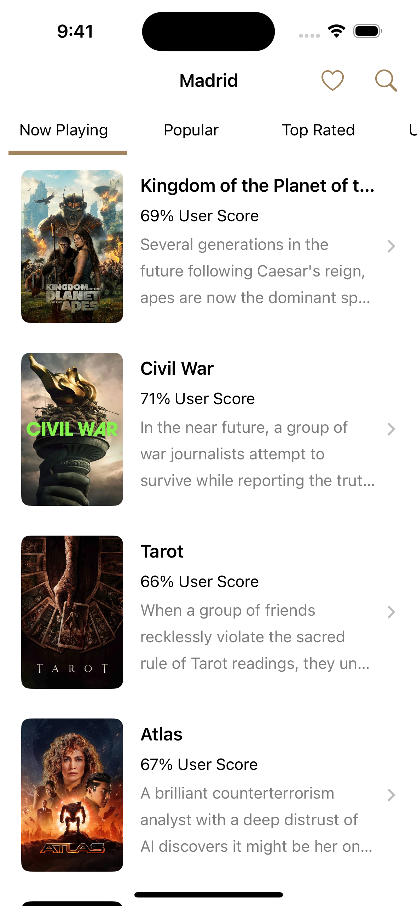

# Madrid

**Madrid** is an iOS application that uses **The Movie Database API**.

- The Composable Architecture
- Swift
- SwiftUI
- UIKit
- SnapKit
- Alamofire
- Realm
- Modern Swift Concurrency
- XCTest

## Screenshots

|  |  |  |
|--|--|--| 
|  |
